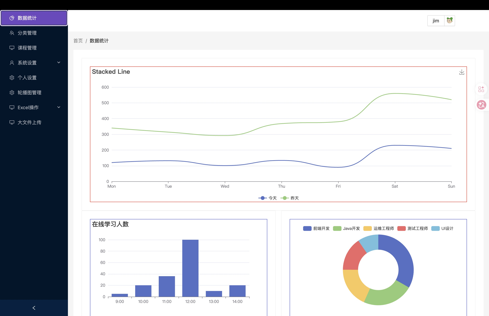
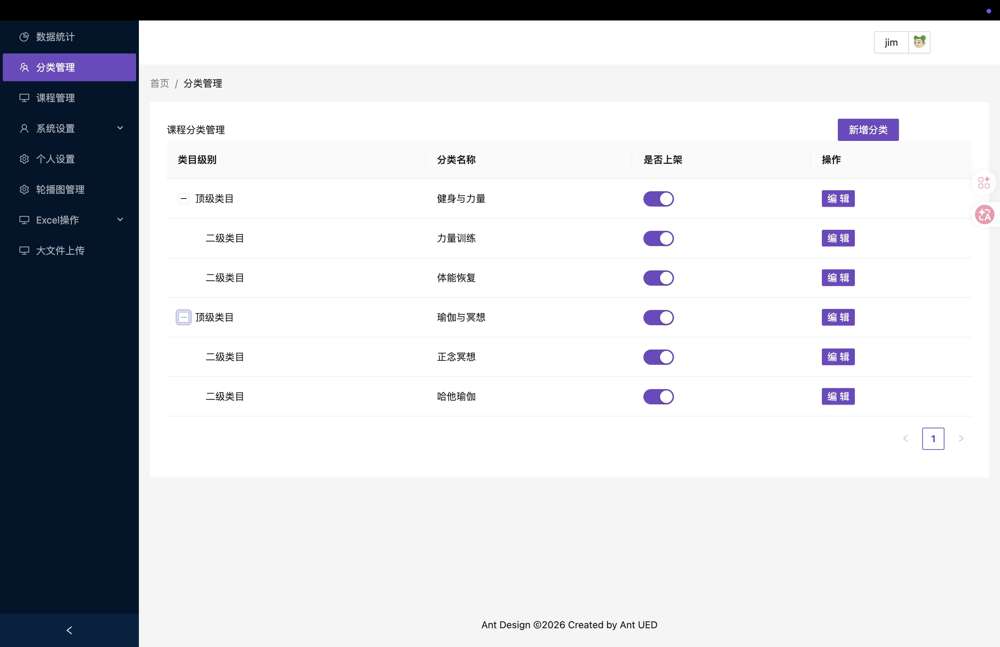
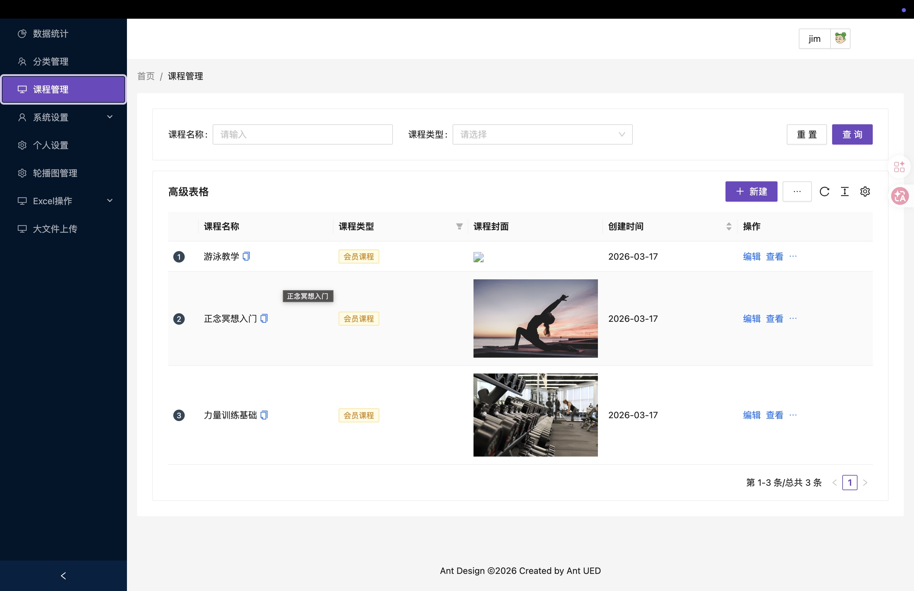
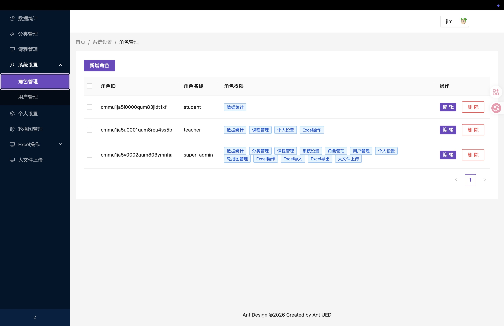
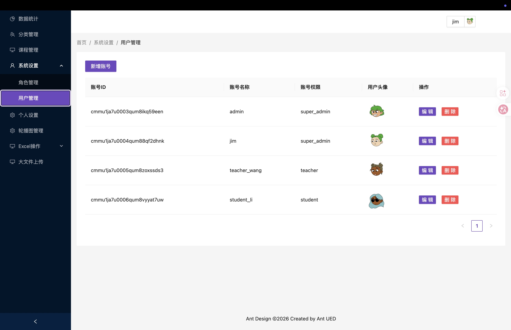

# 在线课程后台管理系统（React + TypeScript）

一个面向在线课程场景的后台管理系统，包含课程分类、课程发布、角色权限、用户管理、轮播图配置、Excel 导入导出和大文件上传演示。

项目采用前后端分离：
- 前端：React + TypeScript + Ant Design + Vite
- 后端：Node.js + Express + Prisma + PostgreSQL（推荐 Supabase）

## 项目截图

<p align="center">
    
    
</p>

<p align="center">
    
    
</p>

<p align="center">
    
</p>

## 功能模块

- 数据看板：折线图、柱状图、饼图（ECharts）
- 分类管理：课程分类树形管理、上架状态切换
- 课程管理：课程列表检索、课程发布（富文本 + 封面上传）
- 系统管理：角色管理、用户管理
- 个人设置：头像与资料更新
- 轮播图管理：图片 + 音频上传
- Excel：账号数据导出、学生数据批量导入
- 大文件上传演示：切片上传、断点续传、秒传（需额外上传服务）

## 技术栈

### 前端

- React 19
- TypeScript
- Vite 6
- Ant Design 5 / Pro Components
- Redux Toolkit
- React Router 7（HashRouter）
- Axios / axios-mock-adapter
- ECharts

### 后端

- Node.js + Express
- Prisma ORM
- PostgreSQL（Supabase）
- bcryptjs

## 项目结构（精简）

```text
.
├── src/
│   ├── api/                # 前端接口封装
│   ├── auth/               # 登录守卫、按钮权限组件
│   ├── components/         # 上传、富文本等通用组件
│   ├── layout/             # 后台布局（侧边栏、头部、面包屑）
│   ├── router/             # 菜单/路由配置
│   ├── store/              # Redux 状态管理
│   ├── utils/              # 请求封装、mock、工具函数
│   └── views/              # 业务页面
├── backend/
│   ├── prisma/
│   │   ├── schema.prisma   # 数据模型
│   │   └── seed.js         # 初始化数据
│   └── src/server.js       # Express API
└── supabase/
    └── config.toml         # Supabase 本地开发配置
```

## 环境要求

- Node.js 18+
- pnpm 9+
- PostgreSQL 15+（或 Supabase 托管/本地）

## 快速开始（推荐：真实后端模式）

### 1. 安装依赖

```bash
pnpm install
pnpm -C backend install
```

### 2. 配置前端环境变量

```bash
cp .env.example .env
```

`.env.example` 默认值：

```env
VITE_USE_MOCK=true
VITE_API_BASE_URL=http://localhost:3001
```

建议联调后端时设置：

```env
VITE_USE_MOCK=false
VITE_API_BASE_URL=http://localhost:3001
```

### 3. 配置后端环境变量

```bash
cp backend/.env.example backend/.env
```

在 `backend/.env` 中填写：

- `DATABASE_URL`：连接池地址
- `DIRECT_URL`：直连地址（Prisma schema 同步使用）
- `PORT`：后端端口（默认 3001）

### 4. 初始化数据库

```bash
pnpm backend:gen
pnpm backend:push
pnpm backend:seed
```

### 5. 启动后端

```bash
pnpm backend:dev
```

健康检查：`http://localhost:3001/health`

### 6. 启动前端

```bash
pnpm dev
```

访问：`http://localhost:5173/#/login`

## 默认账号（seed 后可用）

| 用户名 | 密码 | 角色 |
| --- | --- | --- |
| admin | 123123 | super_admin |
| jim | 123123 | super_admin |
| teacher_wang | 123123 | teacher |
| student_li | 123123 | student |

## Mock 模式说明

当 `VITE_USE_MOCK=true` 时，前端会加载 `axios-mock-adapter`，模拟以下数据接口：

- `/users`
- `/classes/ReactRole`
- `/classes/ReactCategory`
- `/classes/ReactCourse`
- `/classes/ReactChart`
- `/classes/ReactBanner`
- `/batch`

注意：当前 mock 未覆盖 `/login`，若不启动后端，登录会失败。

## 常用脚本

### 根目录

- `pnpm dev`：启动前端开发服务器（5173）
- `pnpm build`：TypeScript 构建 + Vite 打包
- `pnpm preview`：预览构建产物
- `pnpm lint`：ESLint 检查
- `pnpm backend:dev`：启动后端
- `pnpm backend:gen`：生成 Prisma Client
- `pnpm backend:push`：同步 schema 到数据库
- `pnpm backend:seed`：执行种子数据

### backend 目录

- `pnpm dev`：`node --watch src/server.js`
- `pnpm start`：生产方式启动
- `pnpm prisma:generate`：生成 Prisma Client
- `pnpm db:push`：推送 schema
- `pnpm prisma:seed`：执行 seed

## 后端 API 概览

### 鉴权与用户

- `POST /login`
- `GET /users`
- `POST /users`
- `PUT /users/:id`

### 角色管理

- `GET /classes/ReactRole`
- `GET /classes/ReactRole/:id`
- `POST /classes/ReactRole`
- `PUT /classes/ReactRole/:id`
- `DELETE /classes/ReactRole/:id`

### 课程与分类

- `GET /classes/ReactCategory`
- `POST /classes/ReactCategory`
- `PUT /classes/ReactCategory/:id`
- `DELETE /classes/ReactCategory/:id`
- `GET /classes/ReactCourse`
- `POST /classes/ReactCourse`

### 图表、轮播图、批处理

- `GET /classes/ReactChart`
- `GET /classes/ReactBanner`
- `POST /classes/ReactBanner`
- `POST /batch`

## Prisma 模型

- `Role`
- `User`
- `Category`
- `Course`
- `Banner`
- `Chart`
- `Stu`

## 已知事项与限制

- 前端使用 HashRouter（URL 带 `#/`）。
- `PermissionAuth` 组件当前未挂载到主内容路由，页面权限主要依赖菜单过滤。
- 分类页删除按钮使用 `permit=["超级管理员"]`，而 seed 角色名为 `super_admin`，如需启用请自行对齐角色命名。
- 图片/音频上传走 LeanCloud SDK，需可访问 LeanCloud 服务。
- 大文件上传页面依赖独立服务 `http://localhost:3000` 的 `/upload`、`/merge`、`/verFileIsExist` 接口，以及 `spark-md5.min.js` 静态资源；本仓库后端未提供该服务。

## Supabase 本地开发（可选）

仓库已包含 `supabase/config.toml`，并使用了一组自定义本地端口（如数据库 55322、Studio 55323）。

如果你在本地调整了 Supabase 端口，重启 Supabase 服务后再更新 `backend/.env` 中的连接串。

## 说明

本项目用于学习和技术演示，请勿直接用于生产环境。
